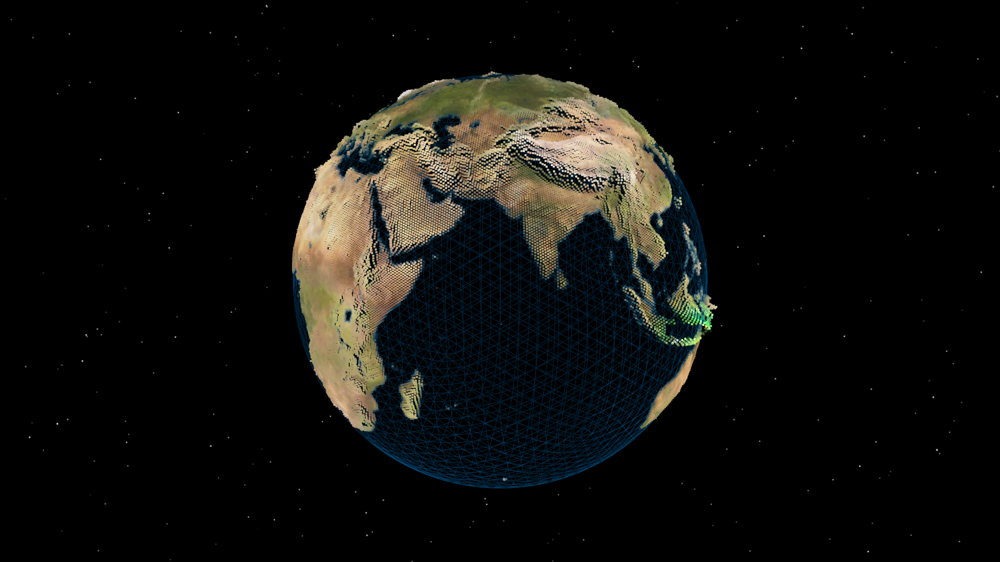

# 🌏 Shader Globe: Interactive Earth

A dynamic shader-driven 3D Earth experience built with **Three.js**, **GLSL**, and **TailwindCSS**. Features a high-detail point-based globe with interactive UV distortion, smooth OrbitControls, and multi-texture blending. Includes a wireframe overlay, reactive lighting, and a star-filled background—fully optimized for performance and responsiveness across devices.

[](https://cyberpunk-landing-page-chi.vercel.app/)

---

## ✨ Features

- 🌍 **Interactive Shader Globe** with high-detail point geometry and UV-based distortion
- 🧠 **Custom GLSL Shaders** blending color, elevation, specular, and alternate textures in real time
- 🧭 **OrbitControls Integration** for smooth user-controlled camera rotation
- 🌌 **Procedural Starfield** with colored particles randomly distributed in 3D space
- 🕹️ **Raycasting Mouse Tracking** to enable pointer-driven globe interaction
- 🧵 **Wireframe Overlay** using `IcosahedronGeometry` for subtle structural depth
- 📐 **Responsive Canvas** Layout with full-screen scaling via **TailwindCSS**
- 🚀 **Performance Optimizations** including capped pixel ratio and efficient rendering loop

---

## 🧠 How It Works

- Generates a high-detail point globe using `IcosahedronGeometry` and custom **GLSL shaders**
- Blends multiple Earth textures (color, elevation, specular, alternate) in the fragment shader
- Uses raycasting to convert mouse position to UV coordinates for interactive distortion
- Animates the globe rotation smoothly using a `THREE.Clock` and time-based updates
- Adds a wireframe mesh for structural clarity and visual depth
- Renders a 3D starfield with randomly placed particles and sprite-based materials
- Handles screen resizing and optimizes clarity using capped device pixel ratio

---

## 🛠️ Built With

- [Three.js](https://threejs.org/) - 3D rendering
- [TailwindCSS](https://tailwindcss.com/) - Utility-first CSS
- [GLSL](https://thebookofshaders.com/) - Custom vertex and fragment shaders for point distortion and texture blending
- [OrbitControls](https://threejs.org/docs/#examples/en/controls/OrbitControls) - For loading the `.glb` torus model
- [TextureLoader](https://threejs.org/docs/#api/en/loaders/TextureLoader) – Loads multiple Earth texture maps
- [Raycaster](https://threejs.org/docs/#api/en/core/Raycaster) – Converts mouse position to UV coordinates for interactivity

---

## Clone the repo

```bash
git clone https://github.com/its-riki-dev/shader-globe.git

# Install dependencies
npm install

# Start the development server
npm run dev

# Build for production
npm run build

# Preview production build
npm run preview
```

---

## 📄 License

- This project is licensed under the MIT License.
